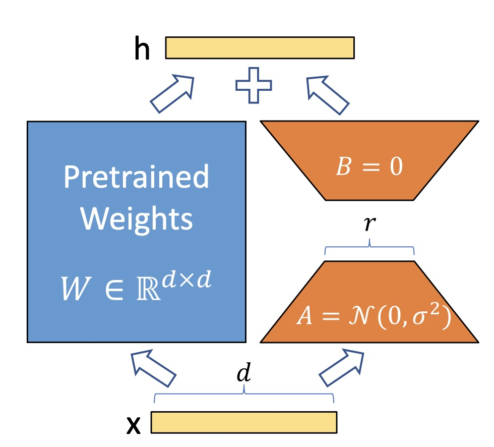

English | [中文](README.zh-CN.md)
<h1>Hands-on LoRa: Practical Fine-tuning LLMs using LoRa</h1>

<h2 style="font-family:'Comic Sans MS', sans-serif; color: green;"><em>Deep Learning is an experimental science. If your hands aren't dirty, how can your mind be nifty?</em></h2>

<h2>Introduction</h2>
 : "LoRA, which freezes the pretrained model weights and injects trainable rank decomposition matrices into each
layer of the Transformer architecture, greatly reducing the number of trainable parameters for downstream tasks."

    Trainable A & B (only)

<h2>Examples</h2>

      <table style="text-align: center;">
          <tr>
            <td>LLM</td>
            <td>No. Parameters</td>
            <td>Task</td>
            <td>LoRa/QLoRa</td>
            <td>Code</td>
          </tr>
          <tr>
            <td>Gemma-IT</td>
            <td>2B</td>
            <td>Text-to-text Generation</td>
            <td>QLoRa</td>
            <td><a href="examples/gemma_text2text">Link</a></td>
          </tr>
          <tr>
            <td>Qwen 2</td>
            <td>1.5B</td>
            <td>Named Entity Recognition</td>
            <td>QLoRa</td>
            <td><a href="examples/qwen_ner">Link</a></td>
          </tr>
          <tr>
            <td>Llama 3</td>
            <td>8B</td>
            <td>Cross-Linguistic Adaptation</td>
            <td>LoRa</td>
            <td><a href="examples/llama_chinese">Link</a></td>
          </tr>
      </table>
  

> [!NOTE]
> LoRa is an elegant technique, yet fine-tuning LLMs with it demands considerable engineering effort. Optimal performance requires thorough optimization. In our repository, we provide foundational examples—consider them your starting point. There are numerous steps to achieve excellence. We encourage you to leverage your talents and creativity to achieve more outstanding results.