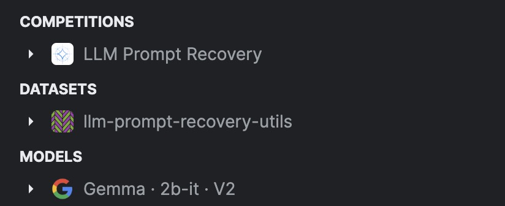

# Gemma -> Text-to-Text Generation

## Basic Information
### Setup Details
- **Accelerator**: NVIDIA Tesla P100 × 1
- **Platform**: Kaggle
- **Internet Access**: Disabled

### Model and Resources
- **LLM**: [Gemma-2B-IT](https://www.kaggle.com/models/google/gemma/Transformers/2b-it/2)
- **Dataset**: [data.csv](https://www.kaggle.com/datasets/xavierspycy/llm-prompt-recovery-utils?select=data.csv)
- **Utilities**: Access the [LLM Prompt Recovery Utils](https://www.kaggle.com/datasets/xavierspycy/llm-prompt-recovery-utils) or view the [Directory Structure](kaggle/input).
- **Adapter Model Weights**: [Download from Kaggle](https://www.kaggle.com/models/xavierspycy/gemma-2b-it-lora-adapter)

<strong>Setup Screenshot</strong>

## Additional Information
### Performance Improvements

    <table style="text-align: center;">
        <tr>
            <th></th> 
            <th>Original Model</th>
            <th>Fine-Tuned Model</th>
        </tr>
        <tr>
            <td>Public Score</td>
            <td>38.50</td>
            <td>49.80</td>
        </tr>
        <tr>
            <td>Private Score</td>
            <td>38.23</td>
            <td>48.50</td>
        </tr>
    </table>

> **Note**: For more details on the evaluation metrics, please refer to the [Evaluation Metric page](https://www.kaggle.com/competitions/llm-prompt-recovery/overview/evaluation).